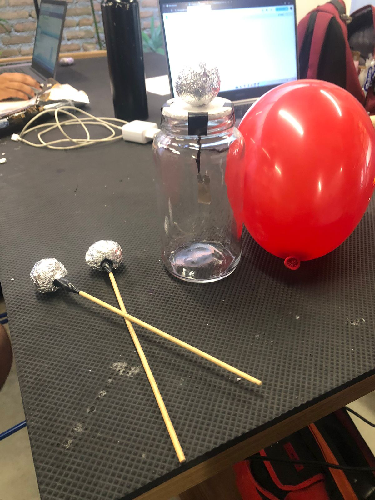
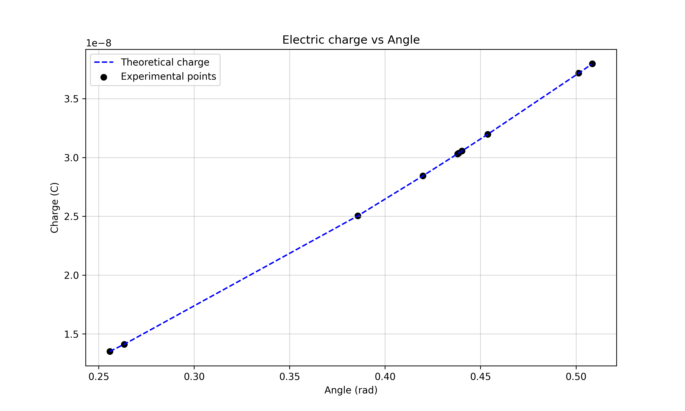
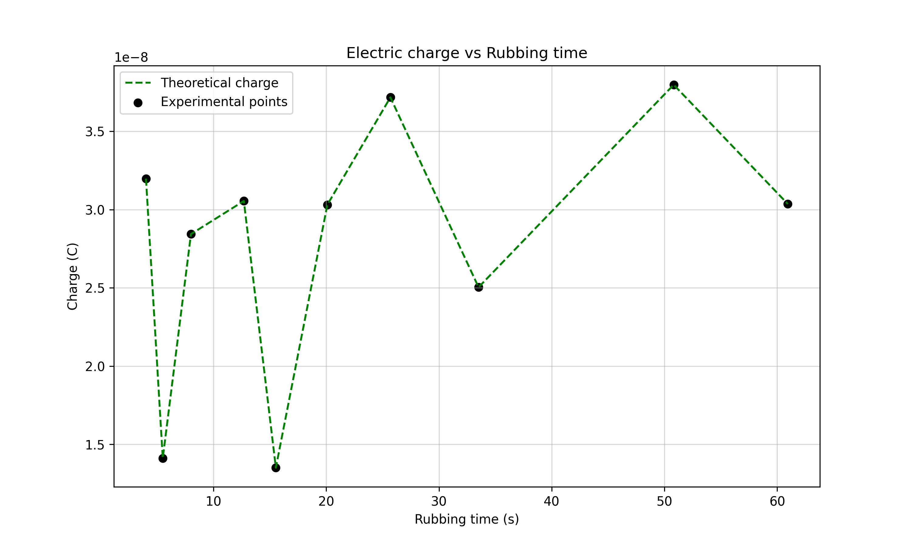
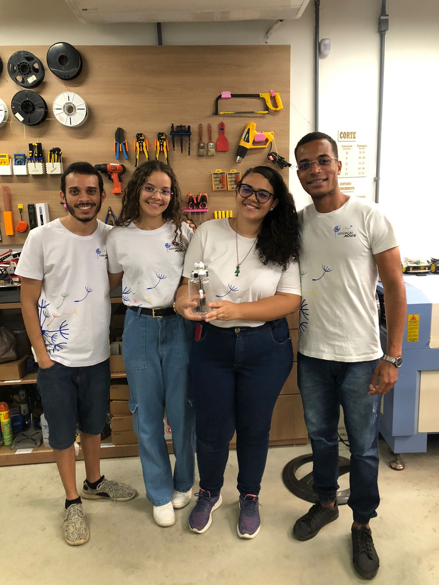

# 🔋 Experimento do Eletroscópio 

>Este projeto foi desenvolvido como parte do experimento de Física Geral III da **Universidade Federal Rural de Pernambuco (UFRPE)**. O objetivo do experimento foi construir um eletroscópio simples capaz de medir a carga elétrica aproximada de objetos carregados e, a partir disso, analisar os dados obtidos.



## Cálculo
O código utiliza uma fórmula deduzida a partir da **Lei de Coulomb** para calcular a carga elétrica acumulada no eletroscópio em função do ângulo de abertura das folhas de alumínio:

```
Q = sqrt(16 * pi * epsilon * L² * m * g * sin(theta)² * tan(theta))
````

### Variáveis:
- `epsilon`: Permissividade do vácuo (8.85e-12 F/m).
- `g`: Aceleração gravitacional (9.81 m/s²).
- `L`: Comprimento das folhas de alumínio (m).
- `m`: Massa das folhas de alumínio (kg).
- `theta`: Ângulo de abertura das folhas (radianos).

>Os valores dos ângulos medidos e tempos de esfregação foram medidos experimentalmente.

## Análise das Medidas

Os gráficos gerados ajudam a interpretar os fenômenos observados no experimento:

- **Carga elétrica vs Ângulo**: Mostra a relação teórica e experimental entre a carga acumulada e o ângulo de abertura do eletroscópio.

  

- **Carga elétrica vs Tempo**: Permite analisar se o aumento do tempo de esfregação resulta em maior carga acumulada.

   

## Integrantes do Grupo

   

- Alysson Victor Silva de Carvalho - Engenharia de Controle e Automação
- Elâne da Silva Ferreira - Engenharia de Controle e Automação
- Maria Eduarda Rodrigues do Nascimento - Engenharia de Controle e Automação
- Yann Keven Jordão Leão - Engenharia da Computação
---
